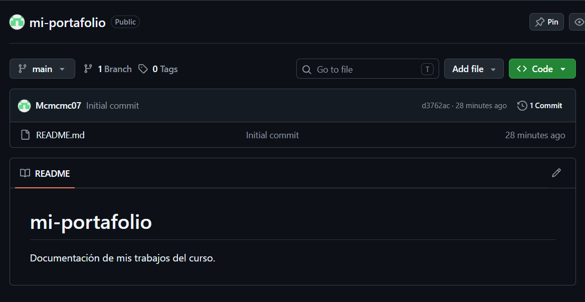

# Guía del proyecto

## ¿Qué es este trabajo?

Este proyecto es una pequeña presentación personal de mi portafolio dentro del curso de Diseño Avanzado de Interfaces de Programación. Su objetivo es mostrar información relevante del estudiante, la ruta de trabajo y la documentación de los laboratorios realizados.

### Propósito del repositorio

El repositorio sirve como espacio de evidencia académica y como ejemplo de organización en GitHub. Aquí se documentan actividades, enlaces útiles y capturas del trabajo para que otros compañeros puedan comprender rápidamente el contexto.

## Instalación y uso

1. Clonar el repositorio en tu equipo usando el comando `git clone`.
2. Abrir la carpeta del proyecto desde Visual Studio Code.
3. Revisar el archivo principal README.md para entender la estructura general.
4. Consultar esta guía para conocer el contexto del trabajo entregado.
5. Ejecutar los comandos de Git para guardar y publicar cambios.

### Recomendaciones para trabajar

- Mantener el README ordenado y actualizado.
- Revisar la vista previa del Markdown antes de confirmar cambios.
- Usar rutas relativas para que los enlaces funcionen en cualquier clon del repositorio.
- Subir los cambios con commits descriptivos.

## Checklist del proyecto

- [x] Crear la estructura base del repositorio.
- [x] Añadir información personal y del curso.
- [x] Incluir una imagen del trabajo realizado.
- [x] Documentar los comandos más frecuentes de Git.
- [ ] Revisar detalles finales de estilo antes de la entrega.

## Archivos y comandos clave

| Elemento               | Descripción                                              |
| ---------------------- | -------------------------------------------------------- |
| README.md              | Presentación principal del proyecto y contenido general. |
| docs/GUIA.md           | Documento guía para explicar el trabajo a otra persona.  |
| img/captura.png        | Captura visual del proyecto para mostrar evidencia.      |
| `git status`           | Revisa el estado actual de los archivos modificados.     |
| `git push origin main` | Publica los cambios en GitHub.                           |

## Comandos de uso

```bash
git status
git add .
git commit -m "Agrega la guia del proyecto"
git push origin main
```

## Enlaces y referencia

- [Guía oficial de Markdown](https://www.markdownguide.org/)
- [Repositorio del proyecto](https://github.com/Mcmcmc07/mi-portafolio)

### Vista previa del trabajo



## Conclusión

Esta guía permite que otra persona entienda de forma rápida qué es el proyecto, cómo abrirlo, cómo revisarlo y qué elementos están incluidos en la entrega. La documentación clara es una parte fundamental del trabajo en tecnología y facilita la colaboración y la evaluación.
